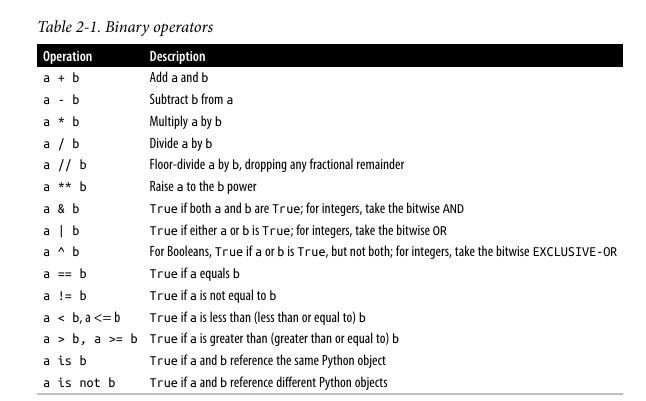
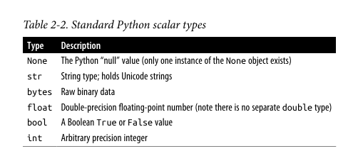

# Day 1: Setup Environment and Some Basics
## Today's Goal
- instalasi dan setup
- tes hello world
- Dasar-dasar bahasa python
## Instalasi and Setup
- python and all library needed isntalled
- vs code + python and jupyter extension running
- setuop git succeed
- Repo GitHub `python-learning-journal` di-init + commit pertama
### challenge
- dont meet one, cause all the tutorial are straight forward
## tes hello world
hello world berhasil dijalankan
### snippet
```python
import sys
import numpy as np
import pandas as pd

print("python version:", sys.version)
print("numpy version:", np.__version__)
print("pandas versio:", pd.__version__)
print("setup berhasil, hello world!")
```
## Dasar-dasar bahasa python
### Semantik
#### Variabel adalah label
Saat melakukan assignment, kita tidak sedang memasukkan nilai ke dalam sebuah "kotak" variabel. Sebaliknya, kita sedang menempelkan sebuah label (nama) ke sebuah objek
#### Semuanya adalah Objek
Di Python, setiap angka, string, list, fungsi, class, hingga modul adalah sebuah objek. Setiap objek memiliki tipe dan data internal.
#### Mutable vs Immutable Objects
##### Mutable (Bisa diubah):
 Objek seperti List, Dictionary, Set, dan NumPy arrays bisa dimodifikasi isinya setelah dibuat
 ##### Immutable (Tidak bisa diubah): 
 Objek seperti Tuple, String, dan Integer (int, float) datanya tidak bisa diubah
 #### Duck Typing
 Sering kali di Python, kita tidak peduli dengan tipe data pasti dari suatu objek, melainkan kita hanya peduli apakah objek tersebut memiliki perilaku atau metode tertentu.
 ## Binary Operation
 
 ## Tipe data skalar python
 
 ## Control Flow
 ### Pernyataan Kondisional (if, elif, else)
 if: Mengecek kondisi awal. Jika True, blok kodenya dieksekusi
elif (kependekan dari else if): Mengecek kondisi tambahan jika kondisi if di atasnya False. kita bisa menggunakan banyak elif dalam satu rantai
else: Blok opsional yang dieksekusi jika semua kondisi if dan elif di atasnya bernilai False. Ini bertindak sebagai kondisi sapu jagat
### Perulangan Pasti / Definite Iteration (for loops)
Loop for digunakan saat kita mengetahui pasti berapa banyak item yang harus diproses, misalnya memproses elemen-elemen di dalam list, matriks NumPy, atau kolom data Pandas. Loop ini mengeksekusi blok kode satu kali untuk setiap item di dalam koleksi data. kita juga sering menggunakan fungsi range() bersama for untuk menghasilkan deret angka secara otomatis
### Perulangan Tak Pasti / Indefinite Iteration (while loops)
Loop while digunakan ketika program harus terus berjalan selama kondisi tertentu bernilai True.
### Pengubah Alur Loop (break dan continue)
break: Langsung menghentikan dan keluar dari loop secara keseluruhan tanpa menjalankan sisa iterasi
continue: Menghentikan iterasi yang sedang berjalan dan langsung melompat kembali ke awal loop untuk memulai iterasi berikutnya
### Pengecualian sebagai Control Flow (try, except, else)
Dalam Python, blok Error Handling (Penanganan Error) sangat umum digunakan sebagai control flow utama. Filosofi ini disebut EAFP (Easier to ask for forgiveness than permission / Lebih mudah minta maaf daripada minta izin)
## Syntax
### Indentasi sebagai Penentu Blok Kode (Bukan Kurung Kurawal)
#### Berbeda dengan bahasa C, C++, atau Java yang banyak digunakan di embedded systems dan menggunakan kurung kurawal {} untuk membuat blok kode, Python sepenuhnya menggunakan spasi (whitespace) di awal baris atau indentasi
Aturan resminya (berdasarkan panduan PEP 8) adalah menggunakan 4 spasi untuk setiap tingkat indentasi
Akhir dari blok kontrol (seperti if atau for) dan blok fungsi selalu ditandai dengan tanda titik dua (:)
### Baris Logis dan Baris Fisik (Logical vs Physical Lines)
#### Python membedakan antara physical line (apa yang Anda lihat di layar) dan logical line (apa yang dieksekusi Python sebagai satu kesatuan)
Pemisah Implisit (Implicit Line Joining): Jika Anda berada di dalam tanda kurung (), kurung siku [], atau kurung kurawal {}, Anda bisa menekan Enter dan memecah kode menjadi beberapa baris fisik tanpa menyebabkan error
Pemisah Eksplisit (Explicit Line Joining): Jika Anda tidak berada di dalam tanda kurung, Anda harus menggunakan karakter garis miring terbalik (\) di akhir baris untuk menyambungkan baris secara eksplisit
Dianjurkan untuk menulis satu baris logis per baris fisik tanpa menggunakan titik koma (;), meskipun Python mengizinkannya
### Format Teks (Strings) dan F-Strings
Sintaksis string di Python bisa dibungkus menggunakan tanda kutip tunggal ('...') maupun kutip ganda ("...").Untuk merepresentasikan hasil kalkulasi ke dalam teks output (logging performa alat), sintaksis yang paling efisien, modern, dan direkomendasikan adalah f-strings (Formatted String Literals). Cukup tambahkan huruf f sebelum tanda kutip pembuka, dan masukkan variabel atau ekspresi ke dalam kurung kurawal {}.
### Komentar dan Docstrings
Inline Comment: Gunakan tanda pagar (#) untuk komentar satu baris
Docstrings: Untuk mendokumentasikan keseluruhan module atau function, gunakan tanda kutip tiga ("""...""")(bisa juga untuk multi line commnet) di baris pertama setelah pendefinisian fungsi. Ini akan menjadi standar standar dokumentasi otomatis